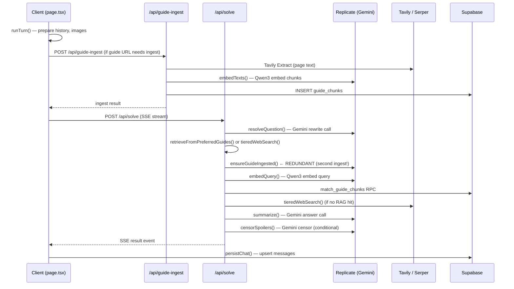

# Audit: Send → Answer Pipeline

Full trace dari user tekan **Send** sampai dapat jawaban.

---

## Pipeline Overview



---

## 🔴 BUGS (Broken)

### 1. `totalLatencyMs` di catch block selalu = 0

**File:** [route.ts](file:///Users/ryan.setiawan/Downloads/GameGuideGo/app/api/solve/route.ts#L303)

```js
totalLatencyMs: Date.now() - (Date.now()), // Always 0!
```

`startedAt` dideklarasi di line 141 (dalam `try`), tapi **accessible** dari `catch` karena berada dalam scope yang sama (`async start(controller)`). Namun, developernya **menulis `Date.now() - Date.now()`** yang jelas selalu 0. Ini bug — seharusnya `Date.now() - startedAt`. `startedAt` **IS** in scope, dev hanya keliru menulis expression-nya.

> **Severity**: Medium — error logs kehilangan timing data, susah debug slow failures.

### 2. `pipelineType` tidak pernah di-set ke `"rag"`

**File:** [route.ts](file:///Users/ryan.setiawan/Downloads/GameGuideGo/app/api/solve/route.ts#L145)

Pipeline type diinisialisasi `"knowledge_only"` (line 145). Ketika RAG hit, `skipWebSearch` = true, sources dipakai — **tapi `pipelineType` tidak pernah di-update ke `"rag"`**. Hanya `"fallback_web"` (line 209) dan `"web"` (line 213) yang di-set. Artinya solve_logs mencatat semua RAG-success sebagai `"knowledge_only"`, membuat analytics tidak akurat.

> **Severity**: Medium — analytics/monitoring jadi misleading.

---

## 🟡 REDUNDANT / WASTEFUL

### 3. Double Ingest — client + server-side `ensureGuideIngested`

**Client** menunggu `runGuideIngest()` (line 2633–2641) lalu memanggil `/api/solve`. **Di dalam `/api/solve`**, `retrieveFromPreferredGuides()` memanggil `ensureGuideIngested()` lagi (guide-rag.ts, line 98–109).

Sudah di-mitigasi: client menunggu ingest selesai dulu, sehingga server-side `ensureGuideIngested` harusnya jadi no-op (`isGuideIndexed` returns true). **Tapi**:

- Setiap panggilan `isGuideIndexed` masih melakukan **2–3 Supabase queries** (count bundle chunks + count by URL + canonical fallback) — tidak gratis.
- Kalau ingest client gagal (network error, timeout) tapi user tetap send, server-side ingest jalan lagi — **double Tavily Extract + double Replicate embed**, bukan graceful retry.

> **Impact**: ~2–3 unnecessary Supabase queries per turn. Rare case: full double-ingest cost.

### 4. `resolveQuestion` selalu dipanggil — bahkan saat search cache hit

**File:** [route.ts](file:///Users/ryan.setiawan/Downloads/GameGuideGo/app/api/solve/route.ts#L151)

Setiap turn **selalu** membayar 1× Gemini `resolveQuestion` call (~200 output tokens) untuk me-rewrite question. Ini dibutuhkan untuk membangun cache key. Tapi kalau search cache sudah hit, rewrite-nya wasted karena kita sudah punya cached results.

**Cost**: 1× Replicate Gemini call (~$0.003-0.005) **per turn**, bahkan kalau hasilnya sudah cached. CLAUDE.md sudah acknowledge ini: *"Every turn pays the `resolveQuestion` rewrite call (needed to build the key) even on a hit."*

> **Impact**: ~$0.003–0.005 per turn wasted pada cache hits. Bisa di-solve dengan hashing raw question + history sebagai preliminary key, check cache dulu, baru rewrite kalau miss.

### 5. 4× `new Replicate()` per turn (worst case)

**Files:** [replicate.ts](file:///Users/ryan.setiawan/Downloads/GameGuideGo/lib/replicate.ts) lines 161, 230, 307; [embed.ts](file:///Users/ryan.setiawan/Downloads/GameGuideGo/lib/embed.ts) line 110

Setiap function (`resolveQuestion`, `summarize`, `censorSpoilers`, `embedTexts`) membuat `new Replicate()` sendiri. SDK Replicate ringan (just stores auth), tapi ini **redundant instantiation** yang bisa di-singleton-kan.

> **Impact**: Negligible perf, tapi code smell.

### 6. 8× Supabase `createClient()` singletons — scattered pattern

8 modul berbeda masing-masing punya `getClient()` singleton sendiri:

| Module | Purpose |
|--------|---------|
| [guide-ingest.ts](file:///Users/ryan.setiawan/Downloads/GameGuideGo/lib/guide-ingest.ts#L36) | Guide chunks DB |
| [guide-rag.ts](file:///Users/ryan.setiawan/Downloads/GameGuideGo/lib/guide-rag.ts#L27) | RAG retrieval |
| [embed-cache.ts](file:///Users/ryan.setiawan/Downloads/GameGuideGo/lib/embed-cache.ts#L10) | Embed cache |
| [search-cache.ts](file:///Users/ryan.setiawan/Downloads/GameGuideGo/lib/search-cache.ts#L13) | Search cache |
| [llm-db-log.ts](file:///Users/ryan.setiawan/Downloads/GameGuideGo/lib/llm-db-log.ts#L12) | LLM call log |
| [solve-log.ts](file:///Users/ryan.setiawan/Downloads/GameGuideGo/lib/solve-log.ts#L12) | Solve journey log |
| [hltb-cache.js](file:///Users/ryan.setiawan/Downloads/GameGuideGo/lib/hltb-cache.js) | HLTB cache |
| [guide-bundle-cache.js](file:///Users/ryan.setiawan/Downloads/GameGuideGo/lib/guide-bundle-cache.js) | Bundle cache |

Semua menggunakan exact same config (`NEXT_PUBLIC_SUPABASE_URL` + `ANON_KEY`, `persistSession: false`). Ini menghasilkan **8 independent Supabase client instances** di memory, masing-masing punya connection pool sendiri.

> **Impact**: Memory waste + connection pool fragmentation. Satu shared `getServerClient()` cukup.

### 7. Sync `readFileSync` / `writeFileSync` di hot path (llm-log.ts)

**File:** [llm-log.ts](file:///Users/ryan.setiawan/Downloads/GameGuideGo/lib/llm-log.ts#L30-L48)

`logLlmCall` membaca dan menulis `llm-log.json` secara **synchronous** (`readFileSync` + `writeFileSync`) pada setiap model call. Di production ini di-skip (`FILE_ENABLED` = false), tapi di dev ini memblokir event loop 2–3x per turn.

> **Impact**: Dev-only, tapi blocks event loop ~1–5ms per write. Use async fs or debounced writes.

---

## 🟠 POTENTIAL API COST BLOWUP

### 8. Tiered Tavily search = up to 4 sequential `advanced` calls

**File:** [tavily.ts](file:///Users/ryan.setiawan/Downloads/GameGuideGo/lib/tavily.ts#L384-L435)

`TIERS` has 4 arrays. Each tier calls `runSearch` with `search_depth: "advanced"`. Tavily advanced = **2× credit cost** vs basic. Worst case (no results in early tiers): **4 advanced calls = ~8 credits** per search.

`MIN_RESULTS = 3` makes it stop early, but for obscure games all 4 tiers will fire. Dan ini terjadi **setiap turn tanpa cache** (kalau Supabase unset, search_cache no-ops).

> **Impact**: ~2–8 Tavily credits per turn. Mitigation: search_cache helps, tapi tanpa Supabase setiap turn pays full price.

### 9. `extractWithAdvancedFallback` — basic + advanced = 2× extract calls

**File:** [tavily.ts](file:///Users/ryan.setiawan/Downloads/GameGuideGo/lib/tavily.ts#L292-L311)

Saat ingest, guide extract selalu coba `basic` dulu. Kalau gagal (GameFAQs sering gagal basic), fallback ke `advanced`. Setiap page yang gagal basic = **2× Tavily Extract credits**.

> **Impact**: 2× extract cost per GameFAQs page ingest. Expected behavior tapi perlu diketahui.

### 10. Worst-case turn: up to 5 Replicate API calls

Per turn (worst case: preferred guide + spoiler censor):

| # | Call | Purpose | Cost est. |
|---|------|---------|-----------|
| 1 | `resolveQuestion` | Rewrite query (Gemini) | ~$0.003 |
| 2 | `ensureGuideIngested` → `embedTexts` | Embed guide chunks (Qwen3) | ~$0.01 (if fresh ingest) |
| 3 | `embedQuery` | Embed query for RAG (Qwen3) | ~$0.002 |
| 4 | `summarize` | Generate answer (Gemini) | ~$0.01 |
| 5 | `censorSpoilers` | Filter spoilers (Gemini) | ~$0.008 |

**Normal turn** (guide already indexed, no spoiler risk): calls 1 + 3 + 4 = **3 Replicate calls**.
**First turn with new guide + spoiler**: all 5 = **5 Replicate calls**.

> **Impact**: $0.015–0.033 per turn. Acceptable tapi harus conscious.

---

## 📊 Summary Table

| # | Issue | Type | Severity | Fix Effort | Status |
|---|-------|------|----------|------------|--------|
| 1 | `totalLatencyMs` always 0 in catch | 🔴 Bug | Medium | Trivial (1 line) | ✅ FIXED |
| 2 | `pipelineType` never set to `"rag"` | 🔴 Bug | Medium | Trivial (3 lines) | ✅ FIXED |
| 3 | Double ingest (client + server) | 🟡 Redundant | Low | Already mitigated | ➖ WONTFIX |
| 4 | `resolveQuestion` on cache hit | 🟡 Wasteful | Low-Med | Medium (hash key) | ✅ FIXED |
| 5 | 4× `new Replicate()` per turn | 🟡 Redundant | Negligible | Easy | ✅ FIXED |
| 6 | 8× Supabase client singletons | 🟡 Redundant | Low | Medium (shared) | ✅ FIXED |
| 7 | Sync FS writes in dev | 🟡 Perf issue | Low (dev) | Easy | ✅ FIXED |
| 8 | 4 tiered Tavily advanced calls | 🟠 Cost | Medium | By design | ➖ BY DESIGN |
| 9 | Basic + advanced extract fallback | 🟠 Cost | Low | By design | ➖ BY DESIGN |
| 10 | Up to 5 Replicate calls/turn | 🟠 Cost | Medium | By design | ➖ BY DESIGN |

---

## Recommended Fixes (Priority Order)

### ✅ Fix Now (Trivial) - ALL FIXED

- [x] **Bug #1** — Fix `totalLatencyMs` in catch
- [x] **Bug #2** — Track RAG pipeline type

### 🔧 Consider Later - ALL FIXED

- [x] **Shared Supabase server client** — single module replacing 8 scattered singletons.
- [x] **Preliminary cache key** from raw `question + history hash` — skip `resolveQuestion` on cache hit.
- [x] **Async file logging** — replace sync FS with append-only or debounced writes.
